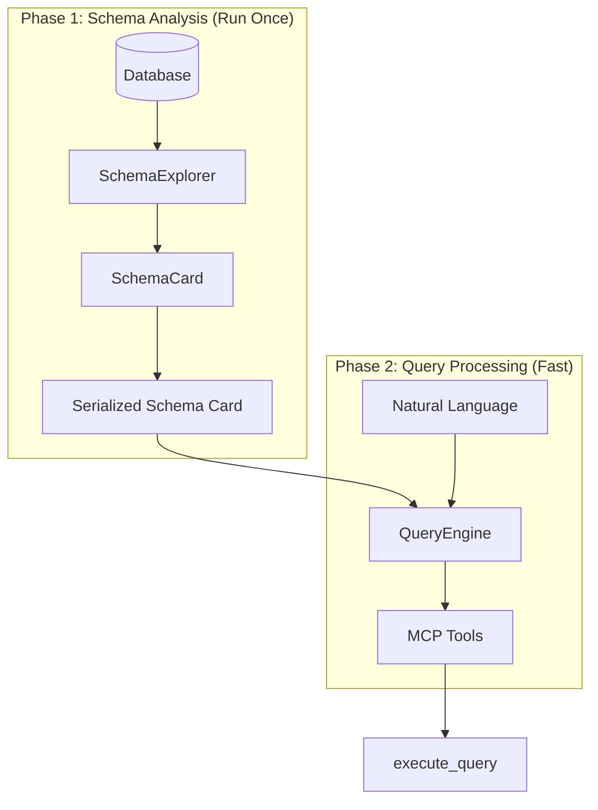

% NL2SQL MCP

A natural‑language‑to‑SQL Model Context Protocol (MCP) server and focused agent that turns a user question into one safe, executable `SELECT` and returns concise, typed results. Built for type‑safety, testability, and cross‑database compatibility.

- Server: FastMCP tools for schema discovery, SQL assistance, and query planning
- Tool: `execute_query`—executes exactly one caller‑provided `SELECT` with strong safeguards
- Engines: Works with SQLAlchemy; validated/transpiled via `sqlglot`


## Features

- **LLM‑ready schema intelligence:** Reflects your DB, profiles columns, builds FK graphs, discovers subject areas, and returns typed planning aids.
- **Safe SQL agent:** Enforces `SELECT`‑only, normalizes dialect, validates with `sqlglot`, applies row and payload budgets.
- **Typed MCP tools:** Analyze query schema, search tables/columns, extract constraints, and expose SQL helpers (validate/transpile/optimize/metadata).
- **Configurable & testable:** Dependency‑injected services with Pydantic models; pure, side‑effect‑free core APIs.


## Architecture

The system separates expensive schema analysis from fast per‑query processing:



- Phase 1 builds a `SchemaCard` with subject areas, table/column profiles, constraints, and graph metrics.
- Phase 2 answers queries using multi‑modal retrieval + FK‑graph expansion against the prebuilt card.


## Modules

- `src/nl2sql_mcp/execute/` — direct execution tool (execute_query)
- `src/nl2sql_mcp/schema_tools/` — schema intelligence MCP tools (see module README)
- `src/nl2sql_mcp/services/` — configuration, schema service, and lifecycle manager
- `src/nl2sql_mcp/sqlglot_tools/` — SQL validation/transpile/metadata MCP tools

For deeper detail, see:

- `src/nl2sql_mcp/execute/` (module docs inline)
- `src/nl2sql_mcp/schema_tools/README.md`
- `src/nl2sql_mcp/services/README.md`
- `src/nl2sql_mcp/sqlglot_tools/README.md`


## MCP Tools Overview

Schema tools (selected):
- `analyze_query_schema(query, max_tables=5, ...)` → `QuerySchemaResult` with relevant tables, join plan, key columns, group/filter candidates.
- `get_database_overview()` → `DatabaseOverview` with subject areas and summaries.
- `get_table_info(table_key, include_samples=True, ...)` → `TableInfo` with columns, PK/FK, constraints, and samples.
- `find_tables(query, limit=10, approach="combo", alpha=0.7)` → `TableSearchHit[]`.
- `find_columns(keyword, limit=25, by_table=None)` → `ColumnSearchHit[]`.
- `get_init_status()` → readiness/error details for the schema service.

SQLGlot tools:
- `sql_validate(sql)`
- `sql_transpile_to_database(sql, source_dialect)`
- `sql_auto_transpile_for_database(sql)`
- `sql_optimize_for_database(sql, schema_map?)`
- `sql_extract_metadata(sql)`
- `sql_assist_from_error(sql, error_message)`


## Tool: execute_query

Executes exactly one caller‑provided `SELECT` safely and returns a typed payload.

Flow:
1. Safety guards (`SELECT`‑only; strip trailing `;`).
2. Dialect: `SqlglotService.auto_transpile_for_database()` and `validate()`.
3. Execute via SQLAlchemy with truncation budgets.
4. Return typed `ExecuteQueryResult` with notes and next‑step hints.

Safeguards:
- Only `SELECT` allowed; no mutations.
- Deterministic truncation by row count and per‑cell character limit.


## Install

Prerequisites:
- Python 3.13
- `uv` for environment management

Setup:

```bash
uv sync
```

Key environment variables (via `.env`):
- `NL2SQL_MCP_DATABASE_URL` (required)
- Result budgets: `NL2SQL_MCP_ROW_LIMIT`, `NL2SQL_MCP_MAX_CELL_CHARS`
- LLM config for agent: `NL2SQL_MCP_LLM_PROVIDER`, `NL2SQL_MCP_LLM_MODEL` (+ optional temperature/top_p/top_k/max tokens)


## Run

Start the MCP server:

```bash
uv run nl2sql-mcp
# or
uv run python -m nl2sql_mcp.server
```

Try the local harnesses (require a live DB and `.env`):

```bash
# Schema intelligence demo
uv run python scripts/test_intelligence_harness.py "show sales by region"

# SQLGlot helpers demo
uv run python scripts/test_sqlglot_harness.py "select top 10 * from dbo.Customers"

# execute_query demo
NL2SQL_MCP_EXAMPLE_SQL='SELECT 1 AS one' uv run python scripts/test_execute_query_harness.py
```

FastMCP documentation: https://gofastmcp.com/llms.txt


## Development

Formatting, lint, types, and tests:

```bash
uv run ruff format .
uv run ruff check --fix .
uv run basedpyright
uv run pytest -q
```

Project structure:
- `src/nl2sql_mcp/` — main package (server, intelligence, services, builders)
- `scripts/` — local harnesses and demos
- `tests/` — test suite
- `docs/`, `examples/`, `data/` — reference and samples

Coding standards:
- Python 3.13, strict type checking, Pydantic/dataclasses for structured data
- Pure functions and dependency injection for testability
- No hard‑coded schema logic; engine‑agnostic via SQLAlchemy


## Supported Dialects

Validation/transpile support via `sqlglot` for:
`sql`, `postgres`, `mysql`, `sqlite`, `tsql`, `oracle`, `snowflake`, `bigquery`.


## Notes

- Embeddings are optional at runtime; retrieval falls back to lexical methods.
- The schema service is initialized once per process and exposes readiness state for clients.
