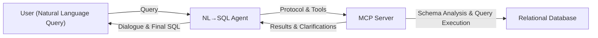
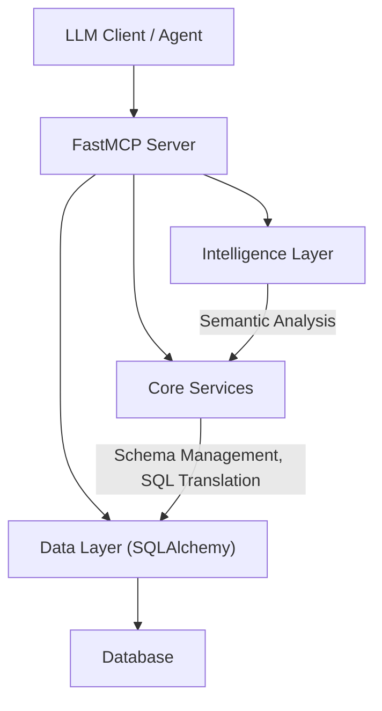
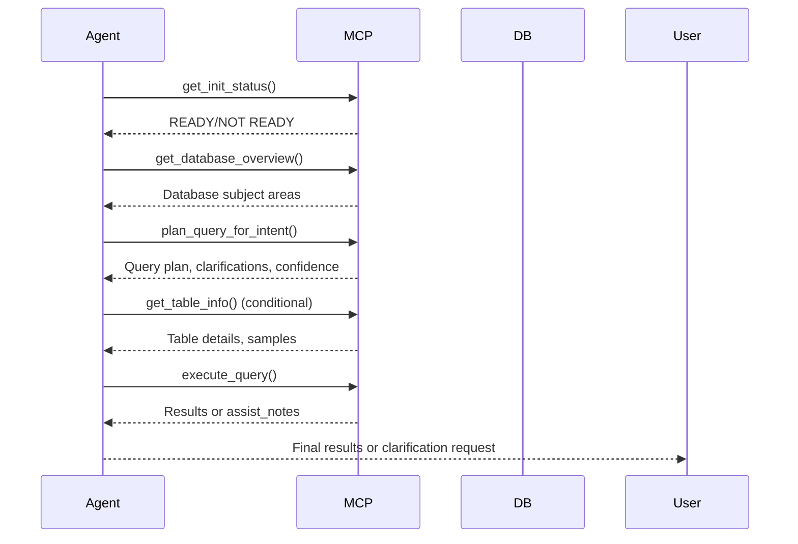

An Architectural Deep Dive into NL2SQL Agent Framework

1. The Challenge: Bridging the Gap Between Natural Language and Relational Databases

The advent of Large Language Models (LLMs) has significantly democratized data access, creating the potential for users to query complex databases using simple natural language. However, the path from a user's question to an accurate, executable SQL query is fraught with technical obstacles. In production environments, simplistic "prompt-to-SQL" solutions fail to achieve the required levels of reliability and safety due to the inherent complexities of both natural language and relational schemas.

Successfully bridging this gap requires a system architected to overcome several fundamental challenges:

* Generalization: The system must adapt to novel databases (domain generalization) and unfamiliar query patterns (compositional generalization) without requiring costly, schema-specific fine-tuning.
* Complexity: The system must be capable of generating sophisticated queries involving multi-table joins, nested structures, and advanced SQL clauses like GROUP BY and HAVING.
* Semantic Ambiguity: The system must accurately map imprecise or ambiguous natural language phrases to the correct tables, columns, and values within a rigid database schema.
* SQL Accuracy and Executability: The system must guarantee that the generated SQL is not only syntactically correct but also executable against the target database dialect and logically sound, returning the results the user intended.

To address these challenges head-on, the framework employs a dual-component architecture that systematically deconstructs the text-to-SQL problem.

2. A Dual-Component Solution: The NL→SQL Agent and the MCP Server

The cornerstone of this framework is the strategic division of labor between two specialized components: a methodical, process-driven NL→SQL Agent and an intelligent, schema-aware Model Context Protocol (MCP) Server. This separation is not merely an implementation detail; it is the foundation of the system's safety, adaptability, and robustness. The agent handles the conversational and procedural logic, while the server encapsulates the complex tasks of schema interpretation and safe data interaction.

### System Architecture Overview

| Component      | Primary Responsibility |
| -------------- | --------------------- |
| **NL→SQL Agent** | Acts as a disciplined planner and orchestrator. It follows a strict protocol to interact with the server, use its tools methodically, validate intermediate outputs, manage the dialogue with the user, and assemble the final query based on confirmed information. |
| **MCP Server**  | Serves as the intelligence core and safety gateway. It performs deep, dynamic analysis of the target database schema, builds a rich knowledge base, provides tools for intent-based query planning, and executes SQL queries through a guarded runtime that enforces strict safety policies. |

The high-level interaction follows a clear, orchestrated flow. An LLM Client, hosting the agent logic, communicates with the FastMCP Server. The server's internal design employs a classic separation of concerns, layering its components by strategic purpose. The Data Layer (powered by SQLAlchemy) acts as a simple adapter for direct database communication. The Core Services abstract the mechanics of interaction, providing foundational capabilities like schema management, SQL dialect translation, and query execution. Finally, the Intelligence Layer handles the semantics of the user's intent, performing schema exploration, graph analysis, and multi-modal retrieval to determine what the data means and how it relates to the user's goal.

This layered architecture ensures that the agent operates on a high-level, semantic understanding of the database provided by the server, rather than interacting with the raw schema directly. We will now examine the internal mechanisms that make the MCP server's intelligence layer so effective.

3. The Intelligence Core: How the MCP Server Analyzes a Database

The strategic value of the MCP server is rooted in its intelligence layer. This component's primary function is to transform a raw, potentially unfamiliar database schema into a rich, machine-readable knowledge base. This process turns the database from a black box into a transparent and navigable resource that an AI agent can query safely and effectively without any hardcoded assumptions.

### MCP Server Layered Architecture

The server employs several key architectural patterns to build and leverage this knowledge base:

1. Asynchronous Initialization and Knowledge-Base Construction The architecture prioritizes immediate availability through a "fast-start then enrich" lifecycle, accepting an initial state of partial knowledge as a deliberate trade-off for rapid service readiness. Upon startup, a conservative schema scan makes the server operational almost immediately. Simultaneously, background threads perform deep enrichment, including relationship mapping and semantic classification. This process is managed by an observable state machine (IDLE, RUNNING, READY), providing robust lifecycle management and operational visibility into the server's readiness.
2. Semantic Schema Analysis The server's analysis goes far beyond simple schema reflection. It automatically classifies tables by their function (e.g., fact, dimension, bridge) and columns by their role (e.g., key, date, metric, category). By analyzing relationships and structure, it can also infer logical "subject areas"—groupings of tables related to a specific business concept, like "Sales Analytics." This semantic layer provides the agent with crucial context that is absent from raw DDL statements.
3. Hybrid Retrieval for Intent Planning To map a user's natural language question to the most relevant database entities, the server utilizes a multi-modal retrieval approach combining lexical matching, vector embeddings, and graph traversal. A core principle of this design is graceful degradation; if a capability like an embedding model is unavailable, the system automatically falls back to lexical search. This hybrid strategy ensures robust and resilient table discovery under various operational conditions.
4. Structured Planning Outputs for LLM Consumption Crucially, the server's tools do not return raw metadata or a final, monolithic SQL query. Instead, the plan_query_for_intent tool provides a structured, type-safe response model designed for an AI agent. This output includes a list of relevant_tables, a proposed join_plan, filter_candidates, a list of clarifications, and a confidence score. The server intentionally withholds a draft_sql query when its confidence is low and clarifications are required, forcing the agent to resolve ambiguity before proceeding. This rich, structured context is the foundation of the system's collaborative reasoning capability.

By providing this set of powerful and safe analytical tools, the server equips the agent with everything it needs to execute its own disciplined protocol for query formulation.

4. The Agent's Protocol: A Step-by-Step Query Formulation Process

A strict, step-by-step protocol is essential for the agent's operation. This discipline is not a limitation but rather the core mechanism that guarantees queries are safe, correct, and built upon validated information. By adhering to a methodical procedure, the agent avoids the guesswork and hallucination that often plague less structured text-to-SQL systems.

### Agent Protocol Flow

The agent's decision-making procedure unfolds as follows:

1. Initialization & Readiness Check
  * Purpose: To confirm that the MCP server has completed its background schema analysis and is fully prepared to handle requests. This prevents the agent from operating on incomplete information.
  * Tool: get_init_status()
2. Orientation & High-Level Understanding
  * Purpose: To acquire a high-level, conceptual overview of the database's structure and primary business domains before attempting to plan a specific query.
  * Tool: get_database_overview
  * Example:
3. Intent-Based Planning
  * Purpose: To translate the user's natural language question into a structured query plan. This step identifies the most relevant tables, proposes join paths, and flags potential ambiguities that need clarification.
  * Tool: plan_query_for_intent
  * Example:
  * The constraints field allows the agent to inject structured facts it already knows, while budget provides performance guardrails for the server's analysis.
4. Targeted Inspection (Conditional)
  * Purpose: To drill down into specific tables identified during the planning phase. This is used to validate schema details, confirm data types, inspect sample values, or better understand column relationships before assembling the final query.
  * Tool: get_table_info
  * Example:
5. SQL Assembly and Safe Execution
  * Purpose: To execute the generated SQL through a guarded runner. This server-side function enforces critical safety policies, including SELECT-only semantics, resource limits (e.g., row caps), and dialect-specific normalization.
  * Tool: execute_query
  * Example:

In the event of an execution failure, the agent uses the structured, assistive notes from the server—specifically the assist_notes and next_action fields—to guide its refinement loop, diagnose the problem, and retry the execution. This methodical process stands in stark contrast to simpler, one-shot generation approaches.

5. Key Differentiators: Beyond Simple Semantic and Syntactic Translation

The architectural choices inherent in this framework deliver tangible benefits over more simplistic text-to-SQL approaches that focus solely on direct dialect translation or basic entity recognition. The system's core value proposition is realized through three key differentiators.

Collaborative Reasoning vs. One-Shot Generation

The interaction between the agent and the server forms a collaborative reasoning loop. Instead of attempting to generate a perfect SQL query in a single, monolithic step, the system deconstructs the problem. The server provides a plan with clarifications, a confidence score, and, upon execution failure, assist_notes. This enables the agent to engage in a dialogue—either with itself to self-correct or with the user to resolve ambiguity—transforming it from a simple translator into a robust problem-solver.

Dynamic Schema Adaptation vs. Static Knowledge

The MCP server builds its knowledge base at runtime by introspecting the live database. This is a critical advantage over systems that rely on pre-trained knowledge or fine-tuning on a static schema representation. Those approaches are brittle; they can become outdated as the database evolves or fail completely when encountering an out-of-distribution schema. Because this framework operates with zero hardcoded schema assumptions, it is inherently adaptable and resilient to change.

Policy-Driven Guardrails vs. Unguarded Execution

Safety is not an afterthought but a core design principle, enforced by the MCP server's execution guardrails. Any query sent by the agent must pass through a gauntlet of non-negotiable checks, providing a robust defense-in-depth for the underlying database.

* SELECT-Only Enforcement: A parser strictly ensures that no data-modifying statements (e.g., UPDATE, DELETE, INSERT) or DDL can be executed.
* Dialect Normalization: The server uses SQLGlot to automatically parse, validate, and transpile SQL, abstracting away database-specific syntax and freeing the agent from needing to be an expert in every possible SQL dialect.
* Resource Management: Configurable row limits and per-cell character truncation are automatically applied to prevent accidental resource exhaustion from overly broad queries.
* Assistive Error Feedback: Provides structured guidance (assist_notes, next_action) on failure, transforming database errors into actionable instructions for the agent's refinement loop.

These differentiators are the direct result of the framework's overarching design philosophy, which prioritizes collaboration and safety.

6. Conclusion: A Framework for Robust and Adaptable Data Interaction

The nl2sql-mcp framework provides a powerful blueprint for building enterprise-grade text-to-SQL systems. Its success is a direct result of adhering to a set of core design principles that prioritize resilience, determinism, and extensibility. The key takeaways from this architecture are encapsulated in these principles:

* Type-Safe Contracts: Guarantee predictable and reliable communication between the agent and server.
* Fast-Ready, Deep-Enrich: Deliver immediate availability while progressively building deep semantic understanding in the background.
* Deterministic Caching: Use content- and config-based hashing to ensure stable performance and predictable behavior.
* Graceful Degradation: Design advanced features (like embeddings) with simpler, reliable fallbacks.
* Pluggable Connectors: Isolate data source interaction behind abstract services to enable future extension.

These architectural tenets work in concert to directly address the foundational challenges of the text-to-SQL domain. They create a system that is not only capable of handling complex queries with high accuracy but is also designed for generalization across new databases, resilient to semantic ambiguity through collaborative clarification, and fundamentally safe by design. By embracing this collaborative, safety-first architecture, the framework provides a robust and extensible solution for bridging the persistent and challenging gap between human language and complex relational databases.
