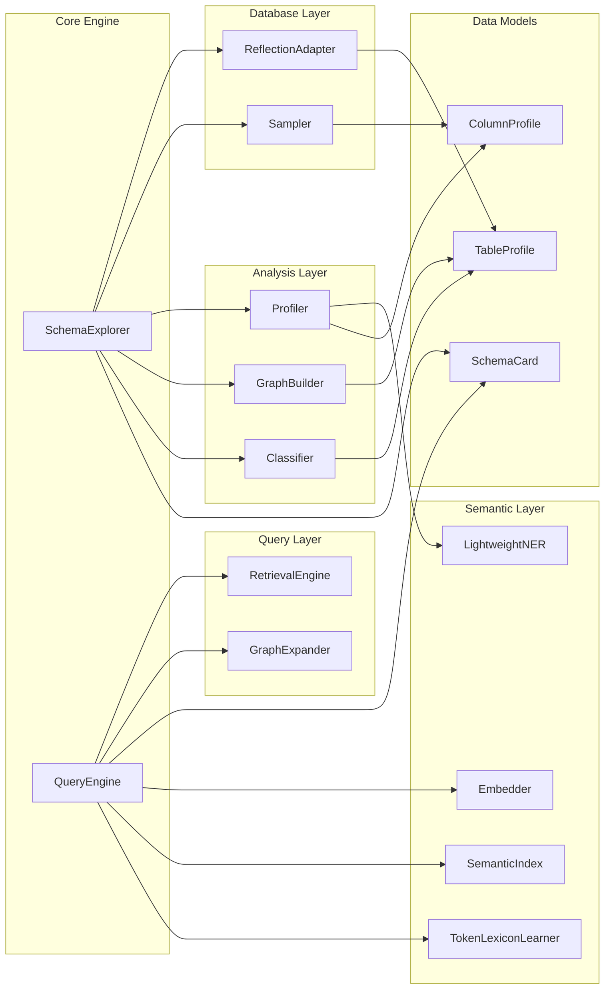
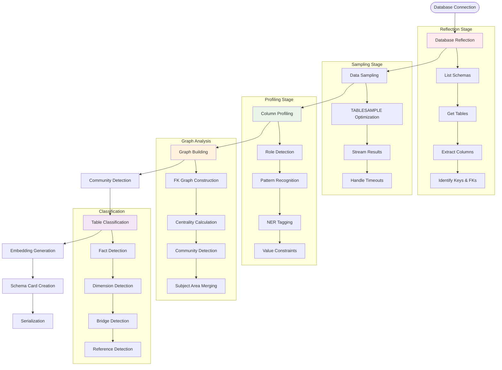
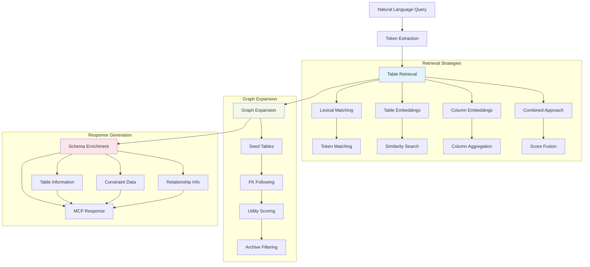
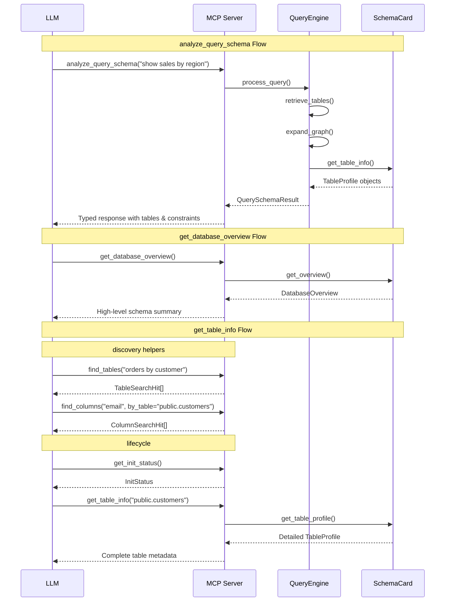

# NL2SQL MCP Intelligence: LLM-Ready Database Schema Analysis

This intelligence module provides **Model Context Protocol (MCP) tools** for LLM-optimized database schema analysis and query processing. It exposes typed, constraint-aware endpoints that help LLMs understand database structure and generate better SQL queries.

The system turns a live relational database into structured, layered metadata with intelligent organization, constraint analysis, and semantic understanding. It reflects your database via SQLAlchemy, profiles columns, builds FK graphs to find subject areas, classifies tables into archetypes, and provides comprehensive constraint information for SQL generation.

## Architecture Overview

The intelligence package follows a **two-phase architecture** optimized for real-time query processing.

### Core Design Principles

1. **Separation of Concerns**: Expensive schema analysis is separated from fast query processing
2. **Type Safety**: All responses use structured Pydantic models for reliable LLM consumption
3. **Semantic Understanding**: Deep column profiling with role detection and semantic tagging
4. **Graph-Based Organization**: FK relationships drive subject area detection and expansion
5. **Multi-Modal Retrieval**: Combines lexical, embedding, and graph-based table discovery

## System Components



## Phase 1: Schema Building Flow

The SchemaExplorer orchestrates comprehensive database analysis:



### Schema Building Components

#### 1. ReflectionAdapter
- **Purpose**: Database metadata extraction using SQLAlchemy
- **Capabilities**: Cross-dialect schema reflection, system schema filtering
- **Output**: Raw schema metadata with tables, columns, keys, and relationships

#### 2. Sampler
- **Purpose**: Efficient data sampling for analysis
- **Optimizations**: TABLESAMPLE clauses, streaming results, timeout handling
- **Output**: Representative data samples for column profiling

#### 3. Profiler
- **Purpose**: Deep column analysis and semantic understanding
- **Features**: Role classification, pattern detection, NER tagging, value constraints
- **Output**: Rich ColumnProfile objects with semantic metadata

#### 4. GraphBuilder
- **Purpose**: Relationship graph construction and community detection
- **Algorithms**: NetworkX-based centrality, greedy modularity optimization
- **Output**: Subject areas and table importance scores

#### 5. Classifier
- **Purpose**: Table archetype detection using dimensional modeling principles
- **Categories**: Fact, Dimension, Bridge, Reference, Operational
- **Output**: Table classifications with human-readable summaries

## Phase 2: Query Processing Flow

The QueryEngine handles real-time query processing against pre-built schema cards:



### Query Processing Components

#### 1. RetrievalEngine
- **Purpose**: Multi-modal table discovery based on natural language queries
- **Strategies**:
  - **Lexical**: Token-based cosine similarity
  - **Embedding (Table)**: Semantic similarity on table descriptions
  - **Embedding (Column)**: Column-level search with table aggregation
  - **Combined**: Weighted fusion of lexical and embedding scores
- **Features**: Archive table de-prioritization, score normalization

#### 2. GraphExpander
- **Purpose**: Expand seed tables with related tables via FK relationships
- **Algorithms**:
  - **FK Following**: Follows foreign keys with utility-based prioritization
  - **Simple**: Direct neighbor inclusion
- **Scoring**: Table utility based on archetype, metrics, dates, centrality

#### 3. Embedding System
- **Embedder**: Sentence transformer wrapper for text encoding
- **SemanticIndex**: Annoy-backed fast similarity search
- **TokenLexiconLearner**: Dynamic query expansion using learned token embeddings

## MCP Tools Interface

The system exposes MCP tools for LLM consumption:



### MCP Tool Details

#### 1. `analyze_query_schema(query, max_tables=5, ...)`
- **Purpose**: Find relevant tables and schema info for a specific query
- **Process**: Query → Retrieval → Expansion → Schema enrichment
- **Output**: `QuerySchemaResult` with rich planning aids:
  - `relevant_tables`, `join_examples`, `key_columns`
  - `suggested_approach`, `main_table`
  - `join_plan` (structured ON pairs), `group_by_candidates`, `filter_candidates`, `selected_columns`

#### 2. `get_database_overview()`
- **Purpose**: High-level database overview with business context
- **Output**: `DatabaseOverview` with subject areas, table counts, and summaries

#### 3. `get_table_info(table_key, include_samples=True, column_role_filter=None, ...)`
- **Purpose**: Detailed table information optimized for SQL development
- **Output**: `TableInfo` with columns, relationships, PK/FK, samples and common filters

#### 4. `find_tables(query, limit=10, approach="combo", alpha=0.7)`
- **Purpose**: Fast table discovery by intent/keywords
- **Output**: `TableSearchHit[]` with scores and optional summaries

#### 5. `find_columns(keyword, limit=25, by_table=None)`
- **Purpose**: Column discovery for SELECT/WHERE scaffolding; uses column embeddings when available, falls back to lexical
- **Output**: `ColumnSearchHit[]`

#### 6. `get_init_status()`
- **Purpose**: Report schema service readiness and previous failure details
- **Output**: `InitStatus { phase, attempts, started_at, completed_at, error_message }`

#### 7. `get_subject_areas(limit=12)`
- **Purpose**: List subject areas discovered during analysis
- **Output**: `SubjectAreaItem[]` with id, name, tables, summary

## Data Models

The system uses strongly-typed Pydantic models for reliable data exchange:

```mermaid
classDiagram
    class SchemaCard {
        +str db_dialect
        +str db_url_fingerprint
        +list[str] schemas
        +dict[str, SubjectAreaData] subject_areas
        +dict[str, TableProfile] tables
        +list[tuple] edges
        +float built_at
        +str reflection_hash
        +to_json() str
        +from_json(str) SchemaCard
    }

    class TableProfile {
        +str schema
        +str name
        +list[ColumnProfile] columns
        +list[tuple] fks
        +list[str] pk_cols
        +str archetype
        +str summary
        +str subject_area
        +float centrality
        +int n_metrics
        +int n_dates
        +bool is_archive
        +bool is_audit_like
    }

    class ColumnProfile {
        +str name
        +str type
        +bool nullable
        +bool is_pk
        +bool is_fk
        +tuple fk_ref
        +float null_rate
        +float approx_distinct_ratio
        +list[str] sample_patterns
        +list[str] semantic_tags
        +str role
        +list[Any] distinct_values
        +tuple value_range
    }

    SchemaCard ||--o{ TableProfile : contains
    TableProfile ||--o{ ColumnProfile : contains
```

### Column Role Classification

The profiler assigns semantic roles to each column:

- **`key`**: Primary keys, foreign keys, identifiers
- **`date`**: Date, datetime, timestamp columns
- **`metric`**: Numeric measures, facts, quantities
- **`category`**: Categorical dimensions, classifications
- **`text`**: Free-form text content
- **`id`**: Identifier columns

### Table Archetype Classification

Tables are classified using dimensional modeling principles:

- **`fact`**: Central transactional tables with measures
- **`dimension`**: Lookup tables with descriptive attributes
- **`bridge`**: Many-to-many relationship tables
- **`reference`**: Static lookup/code tables
- **`operational`**: General operational tables

## Performance Characteristics

### Schema Building (Phase 1)
- **Time Complexity**: O(T × C × S) where T=tables, C=columns, S=sample size
- **Typical Performance**:
  - 100 tables: ~30-60 seconds
  - 1000 tables: ~5-15 minutes
- **Bottlenecks**: Data sampling, embedding generation
- **Optimizations**: TABLESAMPLE, parallel processing, column limits

### Query Processing (Phase 2)
- **Time Complexity**: O(log T) for retrieval, O(E) for expansion
- **Typical Performance**: 50-500ms per query
- **Bottlenecks**: Embedding computation, graph traversal
- **Optimizations**: Pre-built indices, cached embeddings, archive filtering

## Configuration

The system is configured via `SchemaExplorerConfig`:

```python
@dataclass
class SchemaExplorerConfig:
    include_schemas: list[str] | None = None
    exclude_schemas: list[str] | None = None
    per_table_rows: int = 100
    sample_timeout: int = 5
    model_name: str = "sentence-transformers/all-MiniLM-L6-v2"
    build_column_index: bool = True
    max_cols_for_embeddings: int = 20
    expander: str = "fk_following"
    min_area_size: int = 3
    merge_archive_areas: bool = True
    value_constraint_threshold: int = 20
```

## Key Features

### MCP Tools (Primary Interface)
- `get_init_status()` — Check readiness/progress.
- `get_database_overview(req: DatabaseOverviewRequest)` — High-level orientation with optional subject areas.
- `plan_query_for_intent(req: PlanQueryRequest)` — Intent-first planning that returns minimal schema context, a join plan, clarifications, confidence, and a `draft_sql` for immediate execution.
- `get_table_info(req: TableInfoRequest)` — Detailed table information optimized for SQL development.
- `execute_query(req: ExecuteQueryRequest)` — Safe SELECT execution with validation and dialect handling.

Optional (debug): `find_tables(FindTablesRequest)`, `find_columns(FindColumnsRequest)` when `NL2SQL_MCP_DEBUG_TOOLS=1`.

Typed responses use Pydantic models for reliable LLM consumption.

### Usage Examples (Request Models)

- PlanQueryRequest
  ```json
  {
    "request": "Monthly active users for 2024 by region",
    "constraints": {"time_range": "2024-01-01..2024-12-31", "metric": "mau"},
    "detail_level": "standard",
    "budget": {"tables": 5, "columns_per_table": 20, "sample_values": 3}
  }
  ```

- DatabaseOverviewRequest
  ```json
  {"include_subject_areas": true, "area_limit": 8}
  ```

- TableInfoRequest
  ```json
  {
    "table_key": "analytics.events",
    "include_samples": true,
    "column_role_filter": ["key", "date"],
    "max_sample_values": 5
  }
  ```

- ExecuteQueryRequest
  ```json
  {
    "sql": "SELECT region, COUNT(*) AS mau\nFROM analytics.events\nWHERE event_date BETWEEN DATE '2024-01-01' AND DATE '2024-12-31'\nGROUP BY region\nORDER BY mau DESC"
  }
  ```

- FindTablesRequest (debug only)
  ```json
  {"query": "orders by customer", "limit": 8, "approach": "combo", "alpha": 0.7}
  ```

- FindColumnsRequest (debug only)
  ```json
  {"keyword": "created_at", "limit": 20, "by_table": "sales.orders"}
  ```

### Schema Analysis Engine
- **Engine-agnostic** via SQLAlchemy (Postgres, SQL Server, MySQL, Oracle, Snowflake, …)
- **Safe data exploration**: Reflection + light sampling (fast, safe; no raw value retention)
- **Intelligent organization**: FK graph + communities with subject-area merge to reduce fragmentation
- **Smart classification**: Table archetype detection (fact, dimension, bridge, reference, operational)
- **Semantic analysis**: Column role detection (key, date, metric, category, text) + lightweight NER semantic tags (person, org, location) + pattern detection (email, phone, url, %) + value constraints for enum-like columns
- **Constraint capture**: Distinct values and ranges for low-cardinality columns to improve WHERE clause generation

## Use Cases
- **Text-to-SQL agents**: Direct MCP integration for schema context and constraint information
- **LLM applications**: Structured database understanding with typed responses
- **Database exploration**: Developer tool to explore and understand large, multi-schema databases
- **API services**: FastMCP server providing interactive data exploration

## Error Handling

The system includes a comprehensive exception hierarchy:

- **`SchemaExplorerError`**: Base exception for all operations
- **`ReflectionError`**: Database schema reflection failures
- **`SamplingError`**: Data sampling operation failures
- **`EmbeddingError`**: Semantic embedding operation failures

All components implement graceful degradation - embedding failures fall back to lexical search, sampling timeouts return empty DataFrames, and reflection errors skip problematic schemas while continuing with others.
